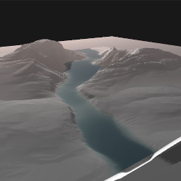
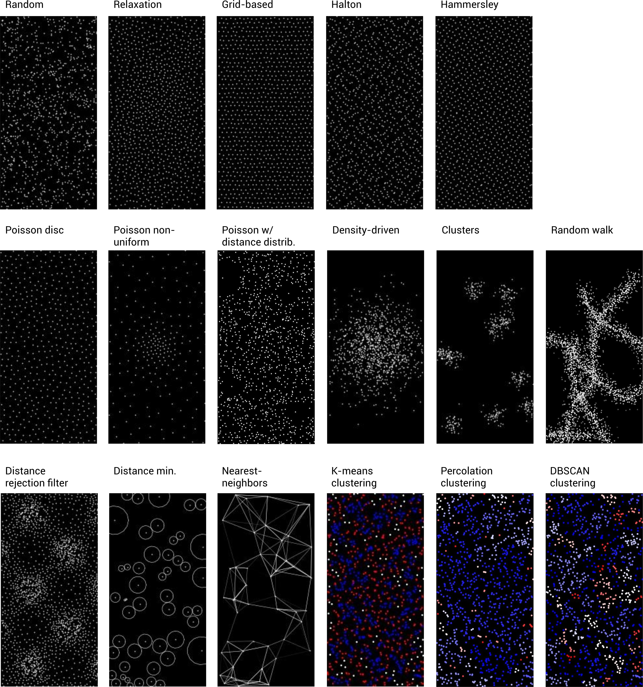
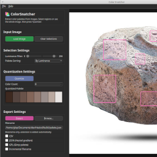
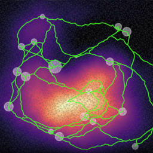
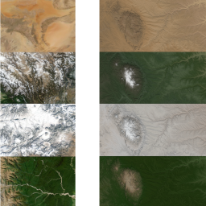
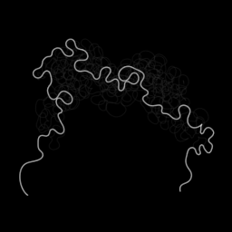
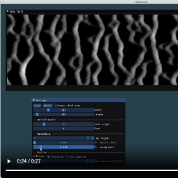
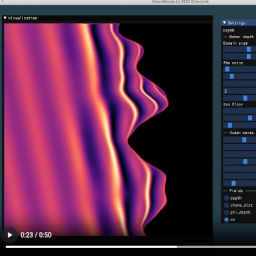
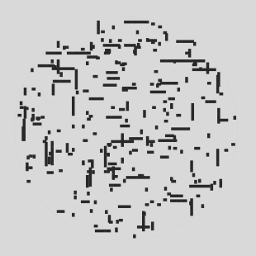
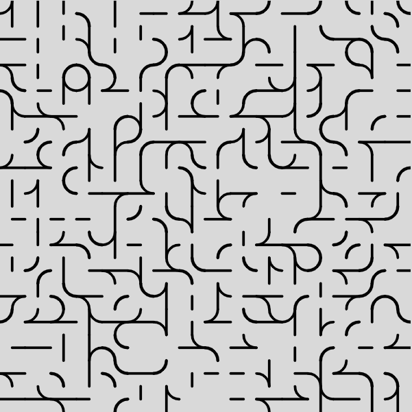

# Hi, I'm **Otto Link**

Welcome to my personal page! I build tools, C++ libraries, and procedural generation systems.

## Projects

### Hesiod - A Desktop Application for Node-Based Procedural Terrain Generation

- binaries: [https://sourceforge.net/projects/hesiod](https://sourceforge.net/projects/hesiod)
- Discord: [https://discord.gg/HBgFCjdV8W](https://discord.gg/HBgFCjdV8W)
- documentation: [https://hesioddoc.readthedocs.io](https://hesioddoc.readthedocs.io)
- GitHub: [https://github.com/otto-link/Hesiod](https://github.com/otto-link/Hesiod)

### HighMap - A C++ Library to Generate Two-Dimensional Terrain Heightmaps

Hesiod is built on **HighMap**:
- GitHub: [https://github.com/otto-link/HighMap](https://github.com/otto-link/HighMap)
- documentation: [https://otto-link.github.io/HighMap](https://otto-link.github.io/HighMap)

### GNode - A Generic Node-Based Data Structure for Node Graph Programming in C++

- GitHub: [https://github.com/otto-link/GNode](https://github.com/otto-link/GNode)
- documentation [https://otto-link.github.io/GNode](https://otto-link.github.io/GNode)

### PointSampler - A C++ Library for Generating (and Labeling) Random 2D, 3D, or n-dimensional Points with Configurable Spatial Distributions

PointSampler is a lightweight C++ header-only library for generating and manipulating points in arbitrary dimensions (1D, 2D, 3D, ... N-dimensional). It includes utilities for random sampling, jittered grids, importance sampling, density warping, spatial relaxation, and point clustering (labeling). The library is designed to be generic, extensible, and dimensionality-independent via std::array and C++ templates.

- GitHub: [https://github.com/otto-link/PointSampler](https://github.com/otto-link/PointSampler)
- documentation: [https://otto-link.github.io/PointSampler](https://otto-link.github.io/PointSampler)

### ColorSnatcher - A Cross-Platform Tool (Linux & Windows) to Extract Colormap from Images

- binaries: [https://sourceforge.net/projects/hesiod](https://sourceforge.net/projects/hesiod)
- GitHub: [https://github.com/otto-link/ColorSnatcher](https://github.com/otto-link/ColorSnatcher)

### AlphaModelRoadNetwork - Demonstrate the Usage of the "alpha model" for Procedural Generation of Large-Scale Road Networks

A python script to demonstrate the usage of the "alpha model" for procedural generation of large-scale road networks.

- GitHub : [https://github.com/otto-link/AlphaModelRoadNetwork](https://github.com/otto-link/AlphaModelRoadNetwork)

### SatColorLUT - A Demonstration of Color Lookup Table Generation for Heightmaps Based on Earth DEM

A python script to generate color lookup table for heightmaps based on earth DEM and true color data.

- GitHub: [https://github.com/otto-link/SatColorLUT](https://github.com/otto-link/SatColorLUT)

### Meanderize - How to Mimic River Meanders and Oxbows Formation

A python script to demonstrate how to mimic river meanders and oxbows formation. Greatly inspired by [https://rarevolume.com/work/meander](https://rarevolume.com/work/meander).

- GitHub: [https://github.com/otto-link/Meanderize](https://github.com/otto-link/Meanderize)

### DuneScape - A Minimalist GUI to Generate Dune Fields using Cellular Automaton

- GitHub: [https://github.com/otto-link/DuneScape](https://github.com/otto-link/DuneScape)

### ShoreWaves - A Minimalist GUI to Generate Shore Gerstner Waves

- GitHub: [https://github.com/otto-link/ShoreWaves](https://github.com/otto-link/ShoreWaves)

### Computer Composition With Lines - Interactive UI
A small interactive web tool inspired by Michaël Noll's 1964 artwork "Computer Composition With Lines". 

- Online interface: [https://otto-link.github.io/NollLines/](https://otto-link.github.io/NollLines/)
- GitHub: [https://github.com/otto-link/NollLines](https://otto-link.github.io/NollLines/)

### RegularTiles
A visual generator that composes patterns from modular geometric tile families such as Truchet, arcs, diagonals, and Molnar-style shapes.

- Online interface: [https://otto-link.github.io/RegularTiles/](https://otto-link.github.io/RegularTiles/)
- GitHub: [https://github.com/otto-link/RegularTiles](https://otto-link.github.io/RegularTiles/)

## Find Me

- GitHub: **[https://github.com/otto-link](https://github.com/otto-link)**
- Discord: **[TODO](TODO)**
